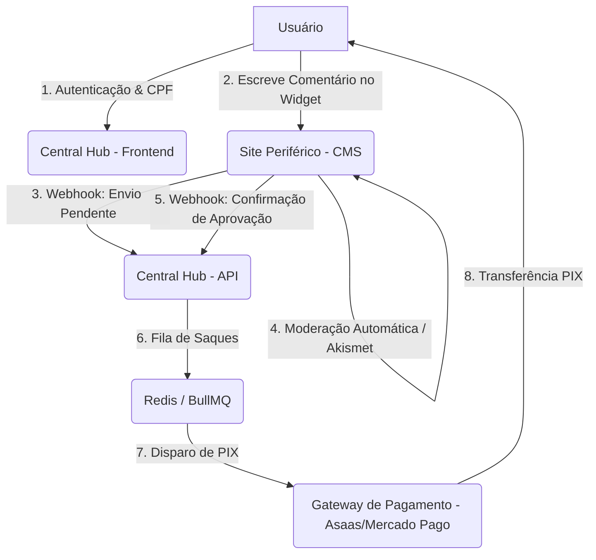
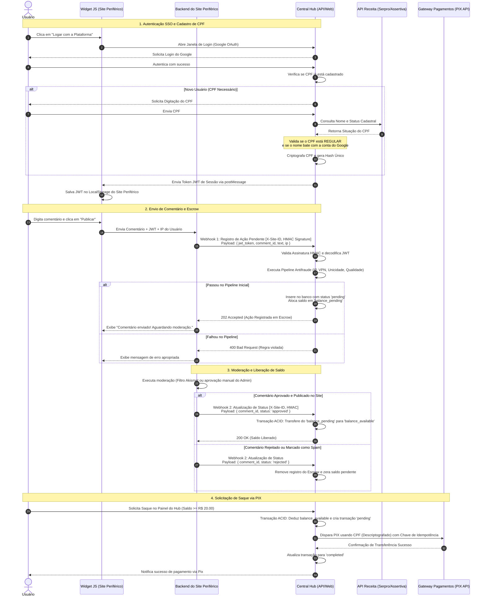
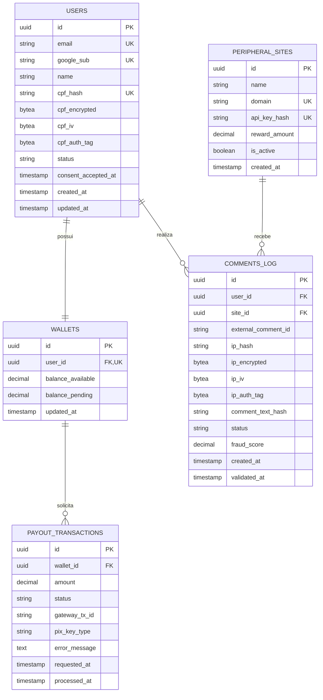
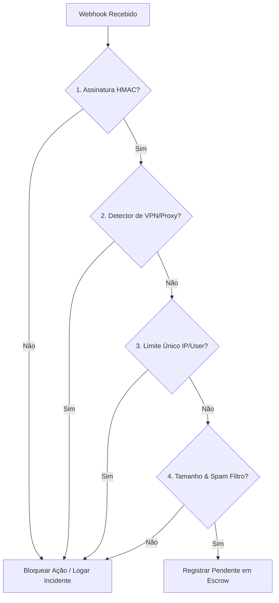
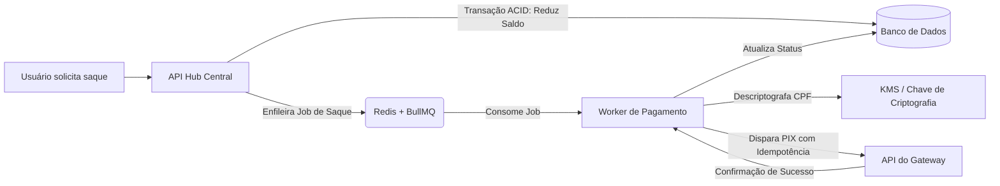

# Documento de Arquitetura de Software - Plataforma de Remuneração por Comentários

Este documento detalha a arquitetura de software, o modelo de banco de dados, os fluxos de integração, os padrões de segurança e as estratégias de pagamento para a plataforma de remuneração por comentários. O sistema baseia-se em um modelo descentralizado composto por um **Central Hub** (para gerenciamento de contas, conformidade, segurança e pagamentos) e **Sites Periféricos** (onde ocorrem as interações e comentários dos usuários).

---

## 1. Visão Geral da Arquitetura

O ecossistema é dividido em dois componentes principais que se comunicam de forma segura através de APIs e Webhooks:

1.  **Central Hub (Hub Central)**:
    *   **Frontend**: Painel administrativo e painel do usuário (wallet, histórico de transações, vinculação de conta, termos de consentimento LGPD).
    *   **Backend (API)**: API REST desenvolvida em Node.js/TypeScript (NestJS) ou Python (FastAPI). Responsável por autenticação via Google OAuth, validação de CPF via APIs de terceiros, controle de saldo das wallets (comentários em escrow), processamento de saques via PIX e execução das regras antifraude.
    *   **Worker & Message Queue**: Redis + BullMQ (ou Celery) para processar transações financeiras de forma assíncrona, garantindo resiliência e escalabilidade.
2.  **Sites Periféricos (Rede de Parceiros)**:
    *   **Widget de Comentários (SDK Frontend)**: Um script JavaScript (embeddable) inserido nos sites parceiros que renderiza a caixa de comentários e gerencia a sessão unificada (SSO) com o Central Hub.
    *   **Plugin/Serviço Backend**: Extensão (ex: Plugin WordPress) que intercepta a submissão de comentários, captura o IP real do usuário, envia requisições assíncronas para o Central Hub e gerencia o status do comentário localmente.



---

## 2. Diagrama de Fluxo do Usuário e Integração SSO

O fluxo a seguir ilustra a jornada de ponta a ponta do usuário, desde a criação da conta até o saque via PIX, detalhando a mecânica do Single Sign-On (SSO) para sites em diferentes domínios.

### Mecânica de SSO com Widget JS
Como os sites periféricos rodam em domínios diferentes do Hub Central, os cookies de sessão padrão não são compartilhados devido às restrições de *SameSite*. Para resolver isso:
1.  O widget JS no site periférico detecta se existe um token JWT no `localStorage` local.
2.  Caso não exista, o widget exibe o botão "Logar com o Hub Central". Ao clicar, abre-se um *Popup* ou redirecionamento para `hub.plataforma.com/auth/sso`.
3.  Após o login com o Google e validação do CPF, o Hub Central redireciona de volta com um token JWT de sessão de curta duração, que o widget armazena no `localStorage` do site periférico.



---

## 3. Modelo de Banco de Dados (PostgreSQL)

O modelo foi projetado com foco em **integridade transacional**, **segurança da informação (PII)** e estrita conformidade com a **LGPD**.

### Diretrizes de LGPD e Proteção de Dados:
*   **Armazenamento de CPF (Dado Pessoal Sensível)**:
    *   `cpf_hash`: Gerado via `SHA-256` concatenado com um Salt fixo do sistema. Usado para validação rápida de unicidade (garante que o mesmo CPF não crie múltiplas contas) sem precisar descriptografar o dado.
    *   `cpf_encrypted`, `cpf_iv` e `cpf_auth_tag`: O CPF original é criptografado simetricamente utilizando o algoritmo **AES-256-GCM**. O vetor de inicialização (IV) e a tag de autenticação GCM são armazenados separadamente para garantir integridade matemática. Ele só é descriptografado em memória no momento de processar o PIX para o Gateway.
*   **Dados de IP (Identificador de Rede)**:
    *   Armazenado como `ip_hash` para validação rápida de unicidade.
    *   Armazenado criptografado (`ip_encrypted`) para auditoria de segurança.
    *   **Política de Retenção (Purge Policy)**: Um job diário deleta os valores brutos (`ip_encrypted`, `ip_iv`, `ip_auth_tag`) de registros criados há mais de 90 dias, mantendo apenas o hash anonimizado para fins estatísticos e prevenção de reincidência de fraudes passadas.
*   **Consentimento**: Campo `consent_accepted_at` registra o exato momento em que o usuário aceitou expressamente os termos de uso e a política de privacidade.

### Diagrama Entidade-Relacionamento (ER)



### Script DDL (PostgreSQL)

```sql
-- Habilita extensão para geração de UUID
CREATE EXTENSION IF NOT EXISTS "uuid-ossp";

-- 1. Tabela de Usuários
CREATE TABLE users (
    id UUID PRIMARY KEY DEFAULT uuid_generate_v4(),
    email VARCHAR(255) UNIQUE NOT NULL,
    google_sub VARCHAR(255) UNIQUE NOT NULL,
    name VARCHAR(255) NOT NULL,
    
    -- Unicidade de CPF garantida de forma segura
    cpf_hash VARCHAR(64) UNIQUE NOT NULL,
    
    -- Criptografia Simétrica AES-256-GCM para o CPF
    cpf_encrypted BYTEA NOT NULL,
    cpf_iv BYTEA NOT NULL,
    cpf_auth_tag BYTEA NOT NULL,
    
    status VARCHAR(20) DEFAULT 'pending_cpf' CHECK (status IN ('pending_cpf', 'active', 'blocked')),
    consent_accepted_at TIMESTAMP WITH TIME ZONE NOT NULL,
    created_at TIMESTAMP WITH TIME ZONE DEFAULT CURRENT_TIMESTAMP,
    updated_at TIMESTAMP WITH TIME ZONE DEFAULT CURRENT_TIMESTAMP
);

CREATE INDEX idx_users_cpf_hash ON users(cpf_hash);

-- 2. Tabela de Sites Periféricos
CREATE TABLE peripheral_sites (
    id UUID PRIMARY KEY DEFAULT uuid_generate_v4(),
    name VARCHAR(100) NOT NULL,
    domain VARCHAR(255) UNIQUE NOT NULL,
    api_key_hash VARCHAR(64) UNIQUE NOT NULL, -- SHA-256 do segredo HMAC
    reward_amount DECIMAL(10, 2) NOT NULL DEFAULT 0.50, -- Valor pago por comentário
    is_active BOOLEAN DEFAULT TRUE,
    created_at TIMESTAMP WITH TIME ZONE DEFAULT CURRENT_TIMESTAMP
);

-- 3. Tabela de Logs de Comentários (Mecanismo Antifraude e Escrow)
CREATE TABLE comments_log (
    id UUID PRIMARY KEY DEFAULT uuid_generate_v4(),
    user_id UUID NOT NULL REFERENCES users(id) ON DELETE CASCADE,
    site_id UUID NOT NULL REFERENCES peripheral_sites(id) ON DELETE RESTRICT,
    external_comment_id VARCHAR(255) NOT NULL, -- ID gerado no CMS externo (ex: wp_comment_id)
    
    -- Hash do IP + site_id para validar limite
    ip_hash VARCHAR(64) NOT NULL,
    
    -- Criptografia Simétrica AES-256-GCM para o IP do usuário
    ip_encrypted BYTEA NOT NULL,
    ip_iv BYTEA NOT NULL,
    ip_auth_tag BYTEA NOT NULL,
    
    -- Hash SHA-256 do texto para evitar spam de comentários duplicados
    comment_text_hash VARCHAR(64) NOT NULL,
    
    status VARCHAR(20) DEFAULT 'pending' CHECK (status IN ('pending', 'approved', 'rejected', 'spam')),
    fraud_score DECIMAL(5, 2) DEFAULT 0.00,
    created_at TIMESTAMP WITH TIME ZONE DEFAULT CURRENT_TIMESTAMP,
    validated_at TIMESTAMP WITH TIME ZONE
);

-- ÍNDICES PARCIAIS (Crucial para a Regra de Negócio):
-- Permitem que um usuário ou IP tente comentar novamente se o comentário anterior tiver sido REJEITADO ou classificado como SPAM.
-- A unicidade estrita de 1 comentário por usuário/IP por site só vale se o status for 'pending' ou 'approved'.

CREATE UNIQUE INDEX idx_unique_user_site_active 
ON comments_log(user_id, site_id) 
WHERE status IN ('pending', 'approved');

CREATE UNIQUE INDEX idx_unique_ip_site_active 
ON comments_log(ip_hash, site_id) 
WHERE status IN ('pending', 'approved');

CREATE INDEX idx_comments_log_lookup ON comments_log(site_id, external_comment_id);

-- 4. Tabela de Carteira (Wallet)
CREATE TABLE wallets (
    id UUID PRIMARY KEY DEFAULT uuid_generate_v4(),
    user_id UUID UNIQUE NOT NULL REFERENCES users(id) ON DELETE RESTRICT,
    balance_available DECIMAL(10, 2) NOT NULL DEFAULT 0.00 CHECK (balance_available >= 0),
    balance_pending DECIMAL(10, 2) NOT NULL DEFAULT 0.00 CHECK (balance_pending >= 0),
    updated_at TIMESTAMP WITH TIME ZONE DEFAULT CURRENT_TIMESTAMP
);

-- 5. Tabela de Transações de Saque
CREATE TABLE payout_transactions (
    id UUID PRIMARY KEY DEFAULT uuid_generate_v4(),
    wallet_id UUID NOT NULL REFERENCES wallets(id) ON DELETE RESTRICT,
    amount DECIMAL(10, 2) NOT NULL CHECK (amount >= 20.00), -- Limite mínimo de R$ 20,00
    status VARCHAR(20) DEFAULT 'pending' CHECK (status IN ('pending', 'processing', 'completed', 'failed')),
    gateway_tx_id VARCHAR(255), -- ID de transação retornado pela API do gateway de pagamento
    pix_key_type VARCHAR(20) DEFAULT 'CPF',
    error_message TEXT,
    requested_at TIMESTAMP WITH TIME ZONE DEFAULT CURRENT_TIMESTAMP,
    processed_at TIMESTAMP WITH TIME ZONE
);
```

---

## 4. Endpoints de API

A segurança das integrações é baseada em assinaturas digitais via **HMAC-SHA256**. O site periférico deve assinar o corpo da requisição usando a chave secreta gerada pelo Central Hub no momento do cadastro do site.

### Protocolo de Validação de Assinatura (HMAC-SHA256)
Toda requisição enviada pelos sites periféricos ao Central Hub deve conter os cabeçalhos:
*   `X-Site-ID`: Identificador público do site periférico.
*   `X-API-Signature`: Código hexadecimal hash gerado a partir do payload da requisição usando a chave privada do site.

#### Exemplo de Validação no Backend do Central Hub (Node.js):
```javascript
const crypto = require('crypto');

function verifyHmacSignature(req, apiSecret) {
  const signature = req.headers['x-api-signature'];
  const payload = JSON.stringify(req.body);
  
  const computedSignature = crypto
    .createHmac('sha256', apiSecret)
    .update(payload)
    .digest('hex');
    
  return crypto.timingSafeEqual(Buffer.from(computedSignature), Buffer.from(signature));
}
```

---

### Endpoint 1: Registro Inicial de Comentário (Webhook 1)
*   **Método**: `POST`
*   **Path**: `/api/v1/comments/submit`
*   **Autenticação**: Cabeçalhos `X-Site-ID` e `X-API-Signature`.
*   **Objetivo**: Realizar a validação inicial do comentário, verificar se viola limites de IP/Usuário, registrar no banco de dados com status `pending` e alocar o saldo em `balance_pending` (escrow).

#### Request Payload:
```json
{
  "user_token": "eyJhbGciOiJIUzI1NiIsInR5cCI6IkpXVCJ9...", // JWT SSO do usuário logado
  "external_comment_id": "wp_comment_23910", // ID no CMS periférico
  "comment_text": "Este artigo trouxe pontos cruciais sobre investimento em renda fixa no cenário macroeconômico atual.",
  "user_ip": "200.189.45.102",
  "user_agent": "Mozilla/5.0 (Windows NT 10.0; Win64; x64) AppleWebKit/537.36..."
}
```

#### Respostas de Sucesso:
*   **`202 Accepted`**: Ação legítima recebida e colocada na fila de moderação.
    ```json
    {
      "status": "success",
      "message": "Comment registered successfully. Pending approval.",
      "comment_id": "cf6d9bc5-7de3-41e9-a3b2-672efad6c2a4",
      "escrow_amount": 0.50
    }
    ```

#### Respostas de Erro:
*   **`400 Bad Request`** (Estouro de limites ou fraude detectada):
    ```json
    {
      "status": "error",
      "code": "LIMIT_EXCEEDED",
      "message": "This account or IP address has already claimed a reward for this site."
    }
    ```
*   **`401 Unauthorized`** (Assinatura ou Token inválidos):
    ```json
    {
      "status": "error",
      "code": "INVALID_SIGNATURE",
      "message": "The HMAC signature or user token is invalid."
    }
    ```

---

### Endpoint 2: Atualização de Status do Comentário (Webhook 2)
*   **Método**: `POST`
*   **Path**: `/api/v1/comments/status-update`
*   **Autenticação**: Cabeçalhos `X-Site-ID` e `X-API-Signature`.
*   **Objetivo**: Acionado de forma server-to-server pelo site periférico quando o comentário for aprovado por um moderador ou marcado como spam pelo sistema interno de CMS.

#### Request Payload:
```json
{
  "external_comment_id": "wp_comment_23910",
  "status": "approved", // Valores possíveis: approved, rejected, spam
  "moderation_reason": "Manual approval by Administrator"
}
```

#### Respostas de Sucesso:
*   **`200 OK`** (Saldo Liberado):
    ```json
    {
      "status": "success",
      "message": "Transaction finalized. Balance moved from pending to available.",
      "released_amount": 0.50
    }
    ```
*   **`200 OK`** (Saldo Rejeitado/Estornado):
    ```json
    {
      "status": "success",
      "message": "Transaction finalized. Escrow balance canceled and removed.",
      "released_amount": 0.00
    }
    ```

#### Respostas de Erro:
*   **`404 Not Found`**:
    ```json
    {
      "status": "error",
      "code": "COMMENT_NOT_FOUND",
      "message": "No pending comment matching external_comment_id and site_id was found."
    }
    ```

---

### Endpoint 3: Solicitação de Saque via PIX (Frontend do Hub Central)
*   **Método**: `POST`
*   **Path**: `/api/v1/wallet/withdraw`
*   **Autenticação**: Bearer JWT (Token de sessão do usuário no Hub Central).
*   **Objetivo**: Acionado quando o usuário solicita a retirada do saldo acumulado no painel da sua conta.

#### Request Payload:
```json
{
  "amount": 50.00
}
```

#### Respostas de Sucesso:
*   **`201 Created`** (Saque aceito e enviado para fila de processamento):
    ```json
    {
      "status": "success",
      "message": "Withdrawal request received. The transfer is processing via PIX.",
      "transaction_id": "e0b943e8-5b12-421f-897b-94adcf92d52f",
      "amount": 50.00
    }
    ```

#### Respostas de Erro:
*   **`400 Bad Request`** (Saldo insuficiente ou abaixo do limite de R$ 20.00):
    ```json
    {
      "status": "error",
      "code": "INSUFFICIENT_FUNDS",
      "message": "Minimum withdrawal is R$ 20.00. Check your available balance."
    }
    ```

---

## 5. Mecanismos de Segurança e Antifraude (Detalhados)

Para que a viabilidade econômica do modelo de negócio se sustente, a prevenção de fraudes (como fazendas de cliques, bots de IA e abuso de VPNs) é prioritária.



### 5.1 Pipeline de Validação em Quatro Etapas

1.  **Validação de Assinatura e Autenticidade (Camada 1)**:
    *   Garante que o payload não foi forjado por um script client-side enviando requisições falsas. A validação HMAC garante que apenas servidores de sites cadastrados e autenticados se comuniquem com o Hub Central.
2.  **Validação de Rede e Reputação de IP (Camada 2)**:
    *   No momento do Webhook 1, o Hub Central consulta a API de Reputação de IP (como **IPinfo.io Proxy Detection** ou **MaxMind GeoIP**).
    *   Bloqueia imediatamente IPs que pertençam a VPNs conhecidas, proxies públicos, redes Tor ou que possuam conexões do tipo Hosting/Data Center (evitando scripts rodando em serviços cloud como AWS, DigitalOcean ou GCP). Apenas conexões residenciais (ISP) são permitidas.
3.  **Validação de Limites Estritos de Banco de Dados (Camada 3)**:
    *   Os índices parciais únicos no banco de dados barram inserções duplicadas concorrentes para o mesmo par `(user_id, site_id)` ou `(ip_hash, site_id)` que estejam marcados como ativos (`pending` ou `approved`).
4.  **Validação Semântica do Texto (Camada 4 - Antispam e IA)**:
    *   **Tamanho Mínimo**: Comentários devem possuir no mínimo 150 caracteres para evitar respostas de baixo valor ("Gostei do post", "Excelente texto", "Obrigado").
    *   **Similaridade Semântica (Fuzzy Matching)**: O sistema calcula a distância de Levenshtein e compara o hash de texto do comentário com os últimos 100 comentários postados pelo usuário na plataforma. Textos repetidos ou com similaridade acima de 85% são automaticamente rejeitados.
    *   **Verificação de Toxicidade e Moderação Local**: Filtro de palavras ofensivas integrado e acionamento obrigatório de ferramentas como Akismet (ou moderação humana) no CMS externo antes da liberação do saldo.

### 5.2 Validação de Identidade (CPF) na Receita Federal
*   **Finalidade**: Evitar contas falsas criadas por geradores de CPF ou uso de CPFs de terceiros sem consentimento.
*   **Mecânica**: No momento do cadastro do CPF, o Hub Central consome a API de validação cadastral (como Assertiva ou Serpro). O sistema valida se o CPF é existente e regular, além de cruzar as primeiras letras do nome associado ao CPF com o nome fornecido no Google OAuth do usuário.

---

## 6. Infraestrutura Financeira e Repasses (PIX)

A arquitetura financeira do projeto utiliza o conceito de **Virtual Wallet (Carteira Virtual)** com **Escrow de Pagamentos** e processamento assíncrono para garantir estabilidade operacional.

### 6.1 Lógica de Concorrência e Transação ACID para Wallet
Para evitar vulnerabilidades de concorrência (*Race Conditions*), o processo de aprovação de comentário e transferência de saldos utiliza transações com bloqueio pessimista (`FOR UPDATE`) no banco de dados relacional.

#### SQL Transacional para Liberação de Saldo:
```sql
BEGIN;

-- 1. Obtém a carteira do usuário aplicando um lock exclusivo na linha (pessimistic lock)
SELECT id, balance_pending, balance_available 
FROM wallets 
WHERE user_id = 'user-uuid-1234' 
FOR UPDATE;

-- 2. Decrementa o saldo pendente (liberação do escrow) e incrementa o saldo disponível
UPDATE wallets 
SET balance_pending = balance_pending - 0.50,
    balance_available = balance_available + 0.50,
    updated_at = NOW()
WHERE user_id = 'user-uuid-1234';

-- 3. Atualiza o log do comentário correspondente para 'approved'
UPDATE comments_log 
SET status = 'approved',
    validated_at = NOW()
WHERE external_comment_id = 'wp_comment_23910' AND site_id = 'site-uuid-5678';

COMMIT;
```

### 6.2 Processamento Assíncrono de Saques (Queue Pattern)
Chamadas de rede a gateways de pagamento externos (Asaas, Mercado Pago, etc.) são propensas a latências elevadas e falhas temporárias de conexão. O Hub Central nunca deve processar o disparo do PIX dentro do ciclo síncrono da requisição HTTP do usuário.



1.  **Dedução de Saldo Imediata (Prevenção de Gasto Duplo)**:
    *   Ao clicar em "Solicitar Saque", a API verifica se o saldo está disponível, deduz o valor solicitado da carteira do usuário (`balance_available`) imediatamente e cria uma transação em `payout_transactions` com o status `pending`.
    *   Isso impede que o usuário faça múltiplos cliques rápidos no botão e consiga sacar um valor maior do que o seu saldo atual.
2.  **Enfileiramento e Processamento via Worker**:
    *   O job da transação é inserido em uma fila do **BullMQ/Redis**.
    *   Um worker em background processa os jobs um a um de forma controlada (rate limiting), evitando sobrecarga no Gateway de Pagamento.
3.  **Idempotência Rígida**:
    *   O worker obtém o ID do saque no banco (`payout_transactions.id`) e o envia ao Gateway de Pagamento como a **Chave de Idempotência** no cabeçalho HTTP (ex: `X-Idempotency-Key`).
    *   Se houver uma queda de conexão no momento do envio e o worker tentar reenviar o mesmo saque, o gateway de pagamento saberá que se trata da mesma transação, evitando pagar o usuário duas vezes.
4.  **Descriptografia do CPF**:
    *   Durante a preparação da transação, o worker recupera o CPF armazenado em `users.cpf_encrypted`, descriptografa o valor em memória usando a chave criptográfica simétrica obtida de forma segura (ex: via AWS KMS, HashiCorp Vault ou variáveis de ambiente altamente restritas) e usa o CPF como chave PIX.
5.  **Mecanismo de Retentativa e Estorno (Refund)**:
    *   **Falhas Temporárias** (ex: instabilidade no gateway): O job é reconfigurado para tentar novamente em intervalos crescentes (backoff exponencial).
    *   **Falhas Definitivas** (ex: CPF inválido cadastrado na chave, conta de destino rejeitada): O worker atualiza a transação como `failed` e executa um estorno automático, devolvendo o valor deduzido ao `balance_available` da carteira do usuário.

---

## 7. Estratégia de Criptografia AES-256-GCM em Código

Abaixo é apresentada a implementação de referência para encriptação e decriptação dos dados pessoais sensíveis (CPF e IP) de acordo com o padrão **AES-256-GCM** adotado para conformidade com a LGPD.

```javascript
const crypto = require('crypto');

// Chave secreta de 32 bytes (256 bits) em formato Hexadecimal (gerenciada pelo KMS/Ambiente)
const ENCRYPTION_KEY = process.env.DB_ENCRYPTION_KEY; 

function encrypt(text) {
  // Vetor de Inicialização de 12 bytes recomendado para GCM
  const iv = crypto.randomBytes(12);
  const cipher = crypto.createCipheriv('aes-256-gcm', Buffer.from(ENCRYPTION_KEY, 'hex'), iv);
  
  let encrypted = cipher.update(text, 'utf8');
  encrypted = Buffer.concat([encrypted, cipher.final()]);
  
  // Tag de autenticação gerada pelo GCM para validação de integridade no decrypt
  const authTag = cipher.getAuthTag();
  
  return {
    encryptedData: encrypted,
    iv: iv,
    authTag: authTag
  };
}

function decrypt(encryptedData, iv, authTag) {
  const decipher = crypto.createDecipheriv(
    'aes-256-gcm', 
    Buffer.from(ENCRYPTION_KEY, 'hex'), 
    Buffer.from(iv)
  );
  
  decipher.setAuthTag(Buffer.from(authTag));
  
  let decrypted = decipher.update(Buffer.from(encryptedData));
  decrypted = Buffer.concat([decrypted, decipher.final()]);
  
  return decrypted.toString('utf8');
}
```

---

## 8. Considerações Finais e Próximos Passos
Esta arquitetura atende de forma robusta e escalável a todos os requisitos do projeto. A separação lógica entre o Hub Central e os Sites Periféricos, associada a mecanismos rígidos de autenticação HMAC, proteção LGPD baseada em hashes e criptografia AES-256-GCM, controle de concorrência com travas pessimistas e resiliência via fila assíncrona, viabiliza uma operação segura contra fraudes e estável no aspecto operacional e financeiro.
